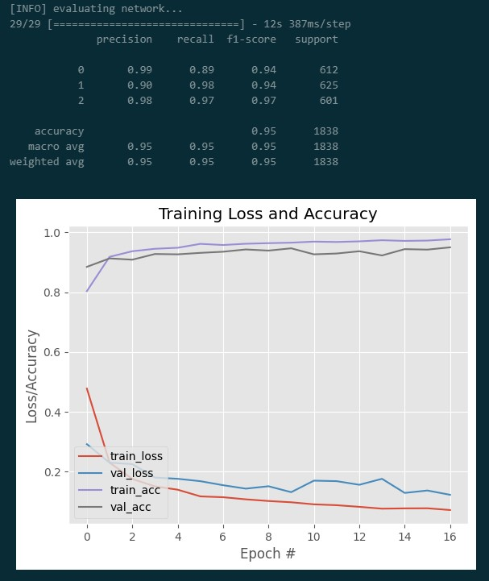

# Face Mask Detection in Real-Time using transfer learning via Mobilenet_V2

Initially, custom and Kaggle datasets of correctly, improperly, and erroneously donned masks of 9.5k human images were selected and trained using transfer learning via Mobile Net V2.
With haarcascade_frontalface_alt2.xml, first the frontal face area is detected in real time, and then the model effortlessly recognizes the categories of face mask detection in humans.
reaching up to a 98 percent score on train data and up to a 95 to 96 percent validation score if more epochs are continued.
In F1, the precision rate was above 90 percent, and on average, it was 95.
Hence, utilizing CV2, sequential learning, transfer learning, and mobilenet v2 with some minor data augmentation, the model performs precisely in real time. Thus, the project was fruitful.

  

<!--  -->
  